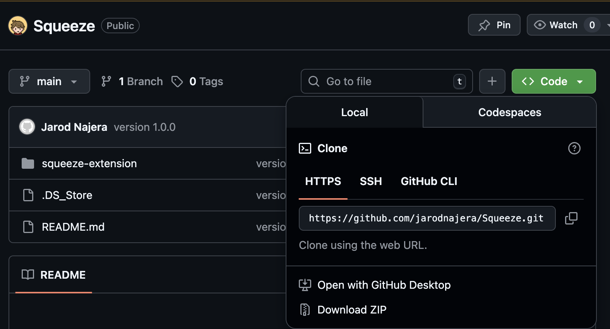

# Squeeze - Pershing IP Converter
This extension lets you enter a list of rep codes and will convert them to their corresponding Pershing IPs in a formatted list

## Installation
I don't plan on actually publishing this extension in any browser marketplace, so you'll have to download the extension here and enable developer mode 
in your browser

Click on the green "Code" button and click "Download ZIP":

You'll then have to unzip the folder and extract the "squeeze-extension" folder anywhere you'd like

You can then follow these tutorials for your browser - 
### Edge:
https://learn.microsoft.com/en-us/microsoft-edge/extensions/getting-started/extension-sideloading

### Chrome:
https://developer.chrome.com/docs/extensions/get-started/tutorial/hello-world#load-unpacked
(You can skip to the "Load an unpacked extension" section)